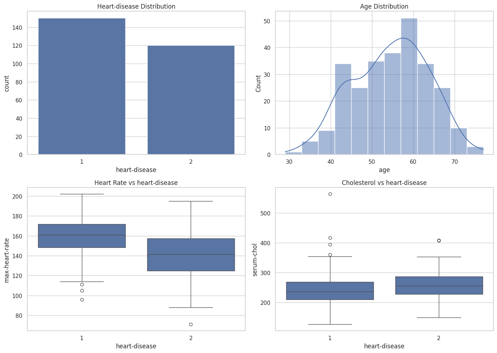
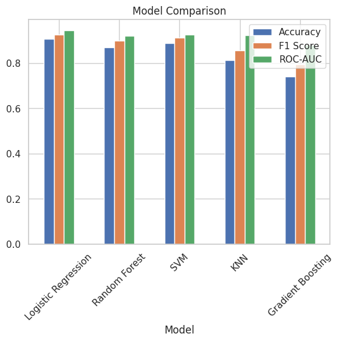
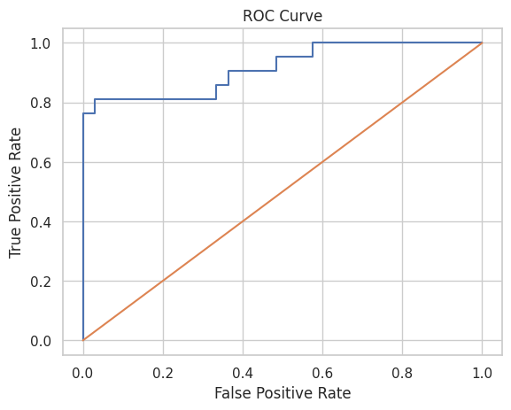

# Heart Disease Prediction: End to End Machine Learning Project
This project analyzes the Statlog (Heart) Dataset from the UCI Machine Learning Repository to explore the factors associated with heart disease. The goal of this analysis is to perform exploratory data analysis (EDA), clean the dataset, perform feature engineering, and builds multiple machine learning models on the Statlog Heart Disease dataset from the UCI Machine Learning Repository. Heart disease is one of the most common and serious health conditions worldwide, making early detection and analysis crucial for improving patient outcomes.

## How to get started
In order to get this project running please download the code using the git clone command

  - 'git clone git@github.com:ashrivastav33/heart-disease-prediction-ml.git'

## Note
- We are making an assumption you already are familiar with using Jupyter Notebook using tools like Google Colab or Jupyter etc.
- You will need an internet connection to download/read the dataset or csv file

## Project Structure

### - /data/data.csv                                          ---> Stores the dataset used for this project
### - /code/heart_disease_prediction_ml.ipynb                 ---> Stores the code/jupyter notebook used for this project

# Dataset

  - Source: Statlog (Heart) Dataset from the UCI Machine Learning Repository
  - The dataset contains 270 observations with 13 medical attributes and 1 target variable indicating the presence or absence of heart disease.

# Objectives
 - Perform data cleaning and preprocessing
 - Conduct exploratory data analysis (EDA)
 - Identify relationships between medical attributes and heart disease
 - Perform feature engineering
 - Build and compare multiple machine learning models for heart disease prediction
 - Evaluate model performance using appropriate metrics (accuracy, recall, F1-score)
 - Derive actionable insights and provide recommendations for early detection of heart disease

## Results

- I tested different models like Logistic Regression, Random Forest, SVM, KNN, and Gradient Boosting.
- Logistic Regression performed the best overall and gave the most reliable results.
- SVM and Random Forest also performed well and showed consistent results.
- KNN performed okay but was slightly lower than the top models.
- Gradient Boosting had the lowest performance among all models.
- I also used cross-validation to make sure the models are stable and not just working well on one split of data.

| Model               | Accuracy | Precision | Recall | F1 Score | ROC-AUC |
|--------------------|----------|-----------|--------|----------|---------|
| Logistic Regression| 0.907    | 0.912     | 0.939  | 0.925    | 0.947   |
| SVM                | 0.889    | 0.886     | 0.939  | 0.912    | 0.926   |
| KNN                | 0.815    | 0.811     | 0.909  | 0.857    | 0.924   |
| Random Forest      | 0.870    | 0.861     | 0.939  | 0.899    | 0.921   |
| Gradient Boosting  | 0.741    | 0.771     | 0.818  | 0.794    | 0.880   |

## Visualizations

## Conclusion

These days, heart diseases have become very common, and many people are facing serious issues like heart attacks and strokes at an early age. Early detection can play a big role in saving lives.
In this project, 
- I explored the heart disease dataset to understand which factors are important in predicting heart disease.
- Through analysis, I found that features like chest pain type, heart rate, and exercise-induced angina have a strong impact.
- I also built multiple machine learning models to compare their performance and understand which works best.
- Overall, this project shows how data and machine learning can help in early detection of heart disease.

### Learning

- This was a fun and helpful learning exercise that made it easier to understand how how to predict heart disease as they seem to be a common factor these days due to lifestyle
  
## Next Steps and Recommendations

 - We can explore more scenarios to learn meaningful insights
 - There are several ways this project can be improved:
   - Performing more advanced hyperparameter tuning for XGBoost
   - Tune model parameters further to improve performance
   - Add more feature engineering to improve prediction
   - Deploy the model using tools like Flask or Streamlit

Based on my analysis:
- Logistic Regression can be used as the final model because it is simple and performs well
- It is important to focus on recall so that we don’t miss patients with heart disease
- The model can be integrated into healthcare systems for early risk detection Regular updates with new data can help improve the model over time
